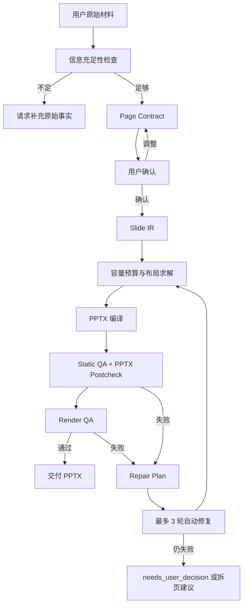

# feipi-techreport-ppt-skill

面向 CTO / 技术负责人的中文技术汇报 PPT 单页撰写 skill。

本 skill 的目标不是把原始材料机械塞进幻灯片，而是把事实材料转成一页可读、可验证、可迭代修复的技术汇报页。它更接近一个小型 Presentation Compiler：先确定页面认知任务，再生成结构化 Slide IR，最后通过 PPTX 编译、反检、渲染和 QA 门禁收口。

## 当前定位

本 skill 是 PPT 撰写和排版层，不是底层文件处理工具。

- 负责：信息充足性检查、Page Contract、内容重构、版式选择、Slide IR、布局预算、QA 门禁、自动修复策略。
- 依赖：底层 `pptx` skill 或本地 `pptxgenjs-native` 后端完成 PPTX 读写。
- 输出：优先生成可编辑 PPTX，禁止默认用整页截图代替 PPT 元素。
- 粒度：默认一页一确认、一页一生成、一页一验收。

## 核心原则

1. 先判断页面要解决的认知问题，再决定怎么画。
2. 一页只保留一个主视觉中心，不把图、表、卡片和长段落平均铺满。
3. 不添加用户未提供的事实、数字、架构细节、路线图承诺或对比结论。
4. 大表、长文和长脚注必须先降维，不在生成后硬挤。
5. 生成 PPTX 不是终点，Static QA、PPTX postcheck、Render QA 才是交付门禁。
6. 规则必须文档、schema、脚本、fixture 同步维护，避免“文档说能做，脚本没实现”。

## PPT 撰写流程

### 1. 收集原始材料

用户可以提供文字、表格、架构描述、流程说明、竞品对比、阶段规划、已有 PPTX 或模板。

最低需要确认四类信息：

| 信息 | 说明 |
|------|------|
| 主题 | 本页讲什么 |
| 结论 | 希望 CTO 看完记住什么 |
| 原始事实 | 支撑结论的数据、模块、流程、对象、对比项 |
| 关系 | 分层、流程、对比、因果、阶段、取舍等关系 |

缺少关键事实时，不生成 Page Contract，不生成 PPT。

### 2. 信息充足性检查

执行者先判断材料是否能稳定支撑当前页。如果信息不足，直接要求用户补充原始信息，不询问风格、颜色、受众或密度。

参考规则：`references/input-sufficiency.md`。

### 3. Page Contract

信息足够后，先输出 Page Contract，锁定本页内容范围和版面预算。

Page Contract 必须包含：

- 本页目标
- 一句话结论
- 使用的原始信息
- 页面内容范围
- 推荐页面结构
- 版面蓝图
- 生成前确认

Page Contract 只给一个推荐结构，不列多个设计方案让用户选择。用户确认前不得生成 PPTX。

参考规则：`references/page-contract.md`、`references/interaction-protocol.md`。

### 4. 选择版式

版式选择依据是“认知任务”，不是原始材料形态。

| 认知任务 | 推荐版式 |
|----------|----------|
| 组件、依赖、边界 | `architecture-map` |
| 层级、职责、技术栈 | `layered-stack` |
| 调用链、数据流、步骤 | `flow-diagram` |
| 方案对比、竞品分析 | `comparison-matrix` |
| 阶段规划、交付路线 | `roadmap-timeline` |
| 指标展示、经营数据 | `metrics-dashboard` |
| 条件判断、路线选择 | `decision-tree` |
| 能力域、模块分组 | `capability-map` |

如果内容超过版式容量，先压缩、合并、抽象或建议拆页。

参考规则：`references/layout-patterns.md`。

### 5. 生成 Slide IR

Page Contract 确认后，先生成 Slide IR，而不是直接写 PPTX 坐标。

Slide IR 负责表达：

- 页面 canvas 和 `layout_pattern`
- region 划分和布局约束
- 页面元素和语义角色
- provenance 来源追溯
- 约束、容量和 QA 期望

核心要求：

- Slide IR 不得引入 Page Contract 未确认的事实。
- 每个 element 的 `source_refs` 必须能追溯到 `source_summary`。
- 生成后必须通过 `scripts/validate_slide_ir.js`。

参考规则：`references/slide-ir.md`、`schemas/slide-ir.schema.json`。

### 6. 布局求解和容量预算

生成 PPTX 前必须做容量预算和布局求解。

优先顺序：

1. 确认 region 是否够用。
2. 检查元素数量是否超出版式上限。
3. 合并重复内容。
4. 缩短标签和 bullet。
5. 把大表转成 KPI cards、heatmap、摘要矩阵或备注。
6. 仍然过载时，输出拆页建议，不强行塞入。

相关脚本和 helper：

- `helpers/ir/capacity.js`
- `helpers/layout/`
- `scripts/solve_slide_layout.js`

### 7. PPTX 编译

编译阶段把 Slide IR 转成可编辑 PPTX。

可用后端：

- `pptxgenjs-native`：当前主要可执行后端，适合工程化生成可编辑元素。
- `template-placeholder`：适合企业模板和固定版式注入。
- `svg-to-drawingml`：适合复杂图形转 DrawingML。
- `html-to-pptx`：适合少量 HTML 布局迁移，但不能默认整页截图交付。

相关入口：

```bash
node scripts/build_pptx_from_ir.js fixtures/architecture-map.slide-ir.json /tmp/output.pptx --allow-warnings
node scripts/generate_pptx_pipeline.js fixtures/architecture-map.slide-ir.json /tmp/output/
```

参考规则：`references/backend-selection.md`、`references/executable-framework.md`。

### 8. QA 门禁

生成后必须通过多层 QA。

| 层级 | 目的 | 入口 |
|------|------|------|
| Slide IR 校验 | 检查 schema、枚举、region、provenance | `scripts/validate_slide_ir.js` |
| Static QA | 检查越界、重叠、字号、文本溢出风险 | `scripts/inspect_slide_ir_layout.js` |
| PPTX Postcheck | 检查 PPTX 文件、文本、placeholder、路径泄漏 | `scripts/inspect_pptx_artifact.js` |
| Render QA | PPTX 渲染为 PNG 后检查真实视觉效果 | `scripts/render_pptx.sh`、`scripts/visual_qa_report.js` |
| Release Gate | 发布前综合门禁 | `scripts/release_gate.sh` |

QA 结果必须结构化输出，能驱动修复。

参考规则：`references/qa-gates.md`、`references/visual-qa.md`、`references/release-gate.md`。

### 9. 自动修复

如果 QA 失败，按 repair plan 最多自动迭代 3 轮。

修复优先级：

1. 压缩文字。
2. 合并 bullet。
3. 把表格改成 cards、heatmap 或摘要矩阵。
4. 减少图中节点。
5. 调整 region 比例。
6. 轻微缩小字号。
7. 仍失败时输出 `needs_user_decision` 或拆页建议。

参考规则：`references/repair-policy.md`、`references/auto-iteration.md`。

## 怎么画 PPT 更合适

当前推荐采用“结构化图解优先”的方法，而不是自由画布式手工摆放。

### 推荐方法：认知任务驱动

每页先回答一个问题：

- 这页让 CTO 做判断，还是理解系统？
- 重点是路径、结构、差异、风险、阶段，还是指标？
- 读者 30 秒内应该带走哪一句结论？

然后再决定画法：

- 结构问题画架构图或分层图。
- 顺序问题画流程图。
- 取舍问题画对比矩阵、heatmap 或决策树。
- 进展问题画路线图。
- 指标问题画 KPI cards + 主图。
- 内容过载时拆页，而不是缩字号硬塞。

### 推荐页面构成

一页技术汇报通常由四块组成：

| 区域 | 作用 | 建议 |
|------|------|------|
| Header | 主题和一句话结论 | 不写空泛标题，标题要带判断 |
| Main Visual | 主要认知结构 | 占 50% 到 65%，只保留一个视觉中心 |
| Evidence Zone | 支撑证据 | 放关键指标、短表、风险、取舍 |
| Bottom Bar | takeaway 和来源 | 结论复述、脚注、数据口径 |

### 不推荐的方法

- 原始材料是表格，就直接塞全量表格。
- 原始材料是长段落，就做文字页。
- 一页同时放多个同等重要的大图。
- 为了放下内容，把正文缩到 8pt 以下。
- 用整页截图代替可编辑 PPT 元素。
- 只看脚本是否生成成功，不看渲染结果。

## 模块化设计系统

PPT 的视觉和组件样式统一维护在 `design-system/`，不要散落到 builder 或单个脚本里。

设计系统按层级组织：

| 层级 | 目录 | 覆盖内容 |
|------|------|----------|
| 原子 token | `design-system/tokens/` | 颜色、字体、圆角、线宽、间距 |
| 组件全集 | `design-system/components/` | 文本、容器、数据、图解、媒体组件 |
| 复杂 pattern | `design-system/patterns/` | 架构图、流程图、矩阵、路线图等组合 |
| 场景 profile | `design-system/profiles/` | CTO 技术汇报等具体风格组合 |
| 样例入口 | `design-system/samples/` | 未来用户提供的样例文件和提取说明 |

当前组件覆盖：

- 文本与说明：文本层级、圆角文本框、代码块、来源脚注。
- 版面与容器：版面区域、分隔线、标签徽标、图例。
- 数据表达：KPI 卡片、原生表格、热力矩阵、原生图表、进度指标。
- 图解与架构：原生组件图、流程步骤、时间线里程碑、决策节点、能力分组。
- 媒体与引用：截图、图片、logo、引用图媒体框。

后续用户提供样例 PPTX 或截图时，先把样例作为设计特征来源，提取到 `tokens/` 和 `components/`，再同步 profile 与 style lock。不要直接把样例里的临时样式写进 builder。

验证入口：

```bash
node scripts/validate_design_system.js
```

详细规则见 `references/design-system.md`。

## 执行步骤总览



## 运行环境和验收层级

```bash
cd skills/authoring/feipi-techreport-ppt-skill
npm ci
```

环境能力由以下命令查看：

```bash
node scripts/doctor.js --json
node scripts/runtime_capabilities.js
```

验收层级：

| 层级 | 条件 | 能验证什么 |
|------|------|------------|
| `static-only` | Node.js | Slide IR、Static QA、benchmark dry-run |
| `pptx-build` | Node.js + `pptxgenjs` | 可生成 PPTX，可做 PPTX postcheck |
| `full` | Node.js + `pptxgenjs` + LibreOffice/soffice | 可生成 PPTX，可渲染 PNG，可做 Render QA |

常用验证：

```bash
bash scripts/test.sh
node scripts/run_benchmarks.js --dry-run --full --json
bash scripts/release_gate.sh
bash scripts/release_gate.sh --strict
node scripts/generate_demo_deck.js --no-render
```

## 规约维护方法

维护时遵循“规则真源清晰、脚本闭环、fixture 兜底”的原则。

### 文件职责

| 位置 | 职责 |
|------|------|
| `SKILL.md` | 触发条件、不可协商规则、主工作流 |
| `README.md` | 维护者入口、执行流程、规约维护方法 |
| `references/` | 详细规则真源 |
| `schemas/` | 机器可校验的数据契约 |
| `helpers/` | 可复用执行逻辑 |
| `scripts/` | CLI 入口、测试、门禁 |
| `fixtures/` | 基础回归样例 |
| `fixtures/benchmarks/` | 质量 benchmark 和期望结果 |
| `templates/style-locks/` | 风格锁定和视觉 token |
| `tmp/` | 临时审计、验证和报告，不作为规则真源 |

### 修改规约的顺序

1. 先判断要改的是触发规则、撰写规则、版式规则、数据契约、QA 门禁还是运行环境。
2. 先修改对应 `references/` 或 schema 真源。
3. 再同步 helper 和 script，实现规则可执行。
4. 增加或更新 fixture / benchmark，覆盖新规则。
5. 更新 `README.md` 或 `SKILL.md` 中的入口说明。
6. 运行测试和 release gate。
7. 把执行记录写到 `tmp/`，不要把临时报告沉淀成规则真源。

### 防漂移规则

- 文档承诺必须有脚本或 fixture 支撑。
- 脚本行为变化必须同步 reference 和 README。
- 新增 layout pattern 必须同时更新 `layout-patterns.md`、Slide IR schema、builder、benchmark 和 release gate。
- 新增 QA 规则必须同时更新 `qa-gates.md`、实现代码、测试 fixture 和 expected report。
- 新增依赖必须同步 `package.json`、`package-lock.json`、`runtime-environment.md` 和安装说明。
- 不提交 `node_modules/`、临时 PPTX、渲染 PNG 或 `tmp/` 下的运行产物，除非用户明确要求保留为样例资产。

## 推荐讨论议题

后续讨论“到底怎么画 PPT”时，建议围绕以下问题收敛：

1. 是否坚持“一页一个认知任务”，避免一页多中心。
2. 哪些场景必须拆页，而不是自动压缩。
3. 每种 layout pattern 的容量上限是否合理。
4. 视觉风格是否固定为 CTO 技术汇报，还是允许按公司模板切换 style lock。
5. Postcheck 和 Render QA 中哪些问题必须 hard fail，哪些可以 warning。
6. Benchmark 是否覆盖了真实高频 PPT 场景。

## 关键参考

- `references/input-sufficiency.md`
- `references/page-contract.md`
- `references/layout-patterns.md`
- `references/slide-ir.md`
- `references/backend-selection.md`
- `references/qa-gates.md`
- `references/visual-qa.md`
- `references/repair-policy.md`
- `references/auto-iteration.md`
- `references/runtime-environment.md`
- `references/release-gate.md`
