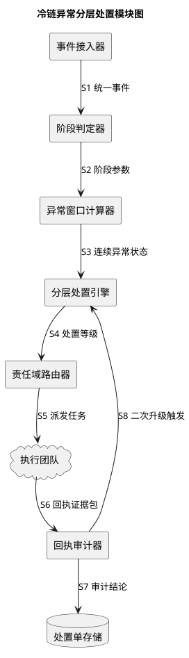
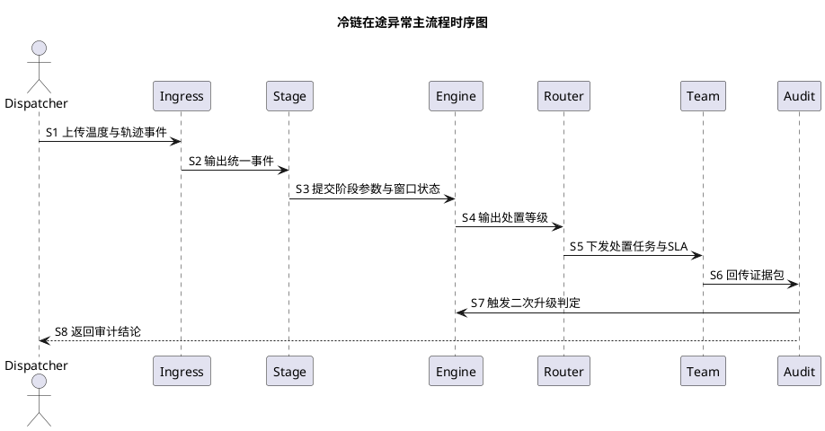
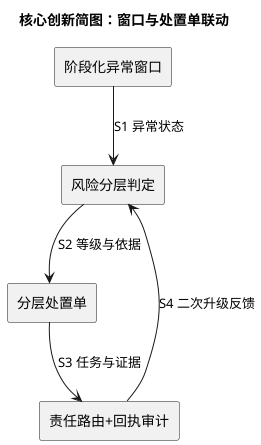

# 一种冷链疫苗运输异常分层处置方法/系统

## 基本信息

### 申请说明
1. 现状问题：现网按单点温度阈值触发告警，短时波动与持续失控都被等价处理，导致值班队列噪声过高。
2. 本方案做法：按运输阶段动态设定异常窗口，先形成分层处置单，再按责任域自动路由并校验回执证据。
3. 解决结果：减少误升级和重复派单，提升异常定位速度与合规追溯质量。

## 提案内容

### 术语解释
1. 温控事件：指一次带业务上下文的温度采样记录，除了温度值，还包含运输单、箱体与阶段标签。与传统差异：传统记录通常只保留设备时间点和温度值。
2. 异常窗口：指在某一运输阶段内持续观察异常的时间区间，用于判断是瞬时抖动还是持续失控。与传统差异：传统方案多使用固定窗口，本方案按阶段动态切换窗口长度。
3. 分层处置单：指把同一窗口内相关异常聚合成一条可执行任务，包含触发依据、责任域和回执 SLA。与传统差异：传统系统常按“单条告警”派发，难以避免重复处理。
4. 责任域映射：指根据运输节点、承运关系和设备归属自动确定处置团队的规则集。与传统差异：传统方式依赖人工判断责任方，响应一致性差。
5. 回执证据包：指处置完成后必须提交的结构化证据集合，包含温度曲线、操作日志、现场动作和恢复时间。与传统差异：传统回执多为自由文本，审计难度高。
6. 二次升级阈值：指首轮处置后继续评估是否需要升级到质量负责人时使用的判定门槛。与传统差异：传统升级通常只看温度是否越界，不看恢复速度和动作有效性。

### 关键词
1. 冷链温控
2. 异常窗口
3. 分层处置单
4. 责任域映射
5. 回执证据包
6. 二次升级

### 应用本方案的产品
已在冷链运输管控平台 ColdRoute 试点，计划 2026-06 全量上线。

### 本方案的背景是什么
1. 需求背景：疫苗运输要求异常可追溯、可审计、可复盘，现网仅靠阈值告警无法稳定满足处置时效考核。
2. 项目背景：平台已接入温度、轨迹、开门、补电等数据，但缺少统一处置对象，导致多源信息无法形成一条闭环任务。
3. 开发背景：现有规则按线路手工维护，临时场景变更时容易漏改，回归成本高且上线风险大。
4. 应用场景：干线在途阶段需要抑制短时噪声，交接阶段需要识别开门导致的可恢复异常，仓内阶段需要保证责任界面清晰。
5. 约束条件：不能改变设备采集频率，不增加司机侧操作负担，且需要兼容现有工单系统接口。

### 行业内哪些竞争对手的业务、产品和本方案相关？请列出竞争对手的名称和相关业务、产品的名称（如有多个请一并列出）
1. Oracle SCM Cloud 冷链监控模块：提供运输可视化与温控告警，关联点是异常检测和告警路由。
2. project44 冷链追踪方案：提供在途温控监测和通知，关联点是运输阶段异常识别。

### 本方案是否有敏感的部分不适合作为专利申请公开？
无。

### 详细介绍与本方案相似的方案及其缺点
1. 固定阈值告警 + 人工派单：实现简单，但无法区分短时波动和持续失控，告警风暴时人工分流失效。
2. 按线路配置多套阈值规则：可做场景细分，但规则膨胀快，临时变更时易漏改且回归成本高。
3. 仅做离线复盘优化：可用于事后分析，但不能支撑实时责任路由和回执时效管理。

### 详细描述本方案，包括组合部分、步骤
#### 技术本质与价值
本方案的技术本质，是把“异常处理对象”从单条告警重构为分层处置单：先用阶段化异常窗口判断风险类型，再把同一窗口内相关事件聚合为一条可执行任务，最后基于责任域映射完成自动派发和回执审计。其直接价值是把值班工作从“看大量噪声告警”转为“执行少量高置信处置任务”，在不改变采集端的前提下同时提升响应速度与追溯质量。进一步地，本方案把“判定依据”和“处置证据”放进同一条任务主线，避免了传统系统中“告警判断在 A 系统、处理记录在 B 系统”的割裂问题，保证异常识别、责任确认、处置回执和后续复盘使用同一份结构化上下文。

#### 模块图

#### 模块说明
1. 事件接入器：统一接收温度、轨迹、开门与补电事件，并完成去重和主键对齐。
2. 阶段判定器：按节点状态和轨迹速度识别仓内、在途、交接阶段，输出阶段参数。
3. 异常窗口计算器：按阶段参数维护滑动窗口，过滤单点脉冲噪声，输出连续异常状态。
4. 分层处置引擎：结合偏离幅度、持续时长、恢复速度给出处置等级（L1/L2/L3）。
5. 责任域路由器：根据节点和合同责任映射责任团队，并附带回执 SLA。
6. 回执审计器：校验证据包字段完整性，并在必要时触发二次升级。

#### 主流程（最常见场景）

1. S1 事件入池：运输中每次采样入池时附带运输单号、箱体号和节点状态，保证后续聚合键一致。
2. S2 阶段识别：系统依据轨迹速度与节点类型判定“在途”阶段，并装载该阶段专用窗口参数。
3. S3 窗口判定：窗口计算器累计偏离量，若仅出现瞬时峰值则保留观察，不直接升级。
4. S4 分层决策：当连续偏离达到阈值时，分层处置引擎生成 L2 处置单并写入触发依据。
5. S5 责任派发：路由器按责任域映射把任务下发给承运商值班员，同时写入回执截止时间。
6. S6 回执提交：值班员提交温度曲线、现场动作和恢复时间，系统仅接收结构化字段。
7. S7 二次判定：若处置后恢复速度低于阈值，审计器触发二次升级并通知质量负责人。
8. S8 闭环沉淀：处置单关闭时，系统沉淀触发条件、动作结果和恢复曲线用于后续策略迭代。

#### 核心创新展开
核心创新是“阶段化异常窗口 + 分层处置单”的联动：前者解决异常识别的准确性，后者解决执行与审计的一致性。窗口负责把噪声和风险分离，处置单负责把判定结果转成可执行任务，两者通过统一序号链路串联，避免“识别正确但执行失真”。在落地上，系统会为每个处置单固化三类字段：触发依据（温度偏离和持续时长）、责任依据（节点与合同映射）、审计依据（回执字段与时效状态）。这三类字段在一次闭环内始终保持可追溯，后续做阈值优化时可以直接按字段回放，不需要再次人工整理样本。

### 是否还有其他解决方案，如有，请详细说明
1. 变体一（窗口策略替换）：将阶段固定窗口改为自适应窗口，依据近期波动自动缩放窗口长度，仍可达到噪声过滤与持续风险识别目标。
2. 变体二（分层策略调整）：保留分层处置单框架，但把 L1/L2/L3 改为“观察/处置/应急”三层语义级别，仍可达到任务聚合与升级控制目标。
3. 变体三（路由策略简化）：在组织边界稳定的场景下，将责任域映射由规则表改为节点直连映射，仍可达到自动派发与回执考核目标。

### 技术效果总结
1. **降低误升级率**：通过阶段化异常窗口区分短时波动与持续失控，减少不必要的高等级告警派发。
2. **缩短异常处置链路**：通过分层处置单聚合多源事件并自动路由责任域，减少人工核查与跨团队交接时间。
3. **提升审计可追溯性**：通过结构化回执证据包和二次升级机制，确保每次处置均可复盘、可核验。

### 提炼本方案的关键技术创新点
1. **处置对象重构**：将“单条告警”重构为“分层处置单”，把判定依据、责任归属和回执约束绑定到同一任务对象。
2. **阶段化窗口联动分层**：在不同运输阶段动态设定窗口参数，并将窗口结果直接驱动分层决策，提升判定稳定性。
3. **判定与执行闭环耦合**：把责任路由、回执审计与二次升级纳入同一序号链路，避免识别与执行脱节。
