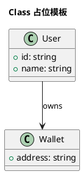

# Class 图参考（待补充业务样例）

## 当前状态

- 已预留独立 reference 文件。
- 后续补样例时，独立维护继承、关联、组合的表达方式。

## 暂用模板

```plantuml
@startuml
title Class 占位模板
top to bottom direction
class User {
  +id: string
  +name: string
}
class Wallet {
  +address: string
}
User --> Wallet : owns
@enduml
```

## 补充样例时的最小要求

1. 覆盖属性、方法、关系三类信息。
2. 标签过长必须换行，避免横向撑宽。
3. 对复杂关系优先分层展示，不在同层平铺过多类。
