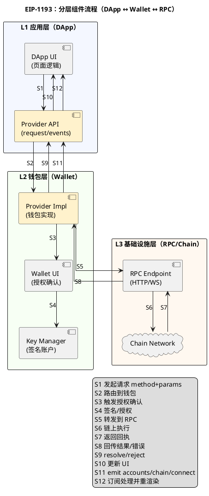

# Component 图参考

## 适用场景

- 描述系统模块边界、调用链路、插件关系。
- 需要在一张图里同时表达“分层结构 + 跨层流程”。

## 强约束（component 专属）

1. 模块必须分层
- 至少分为 3 层（如应用层 / 钱包层 / 基础设施层）。
- 每层用独立 `rectangle` 包裹，避免同层平铺导致过宽。

2. 不同层颜色必须区分
- 例如：
- 应用层：`#F4F7FF`
- 钱包层：`#F7FFF4`
- 基础设施层：`#FFF8F0`

3. 模块间流程必须用 edge 串联
- 跨层交互必须显式写连线（`-->` 或 `..>`）。
- 流程序号统一从 `S1` 开始，例如 `S1`、`S2`、`S3`。

4. 宽度控制
- 使用 `top to bottom direction`。
- 建议开启 `skinparam linetype ortho` 减少斜线交叉。
- 推荐 `skinparam nodesep 6` 与 `skinparam ranksep 75`。
- 标签过长必须换行（`\\n`）避免横向撑宽。
- 可用 `-[hidden]down->` 约束层级与模块纵向排布。

5. edge 文案可读性
- 复杂图中，edge 标签默认使用短编号（如 `S1`、`S2`），避免长句直接压在线上。
- 详细步骤说明推荐放到 `legend` 或 `note`，减少标签重叠。
- 渲染后必须看图像（image）复核：若存在重叠/遮挡，需继续优化（简化文案或调整路由）后再交付。

## 标准样例（分层 + 分色 + S 序号 + 换行）



## 样例验收命令

```bash
bash scripts/check_plantuml.sh ./tmp/component-sample.puml
```
