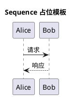

# Sequence 图参考（待补充业务样例）

## 当前状态

- 已预留独立 reference 文件。
- 后续补样例时，不与 component/class 混写。

## 暂用模板

## 补充样例时的最小要求

1. 包含真实业务实体命名。
2. 包含至少 1 条主链路和 1 条异常链路（如超时/错误）。
3. 不使用 `top to bottom direction`，通过控制参与者数量与标签换行来避免过宽。
